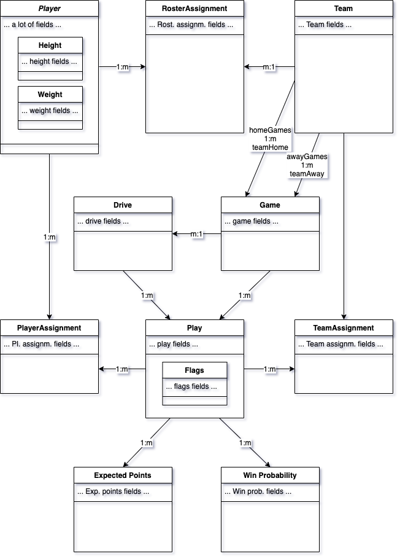

Entities
========

The base data comes as CSV files and as such consists of "flat" data. 
Every play resp. roster assignment of a player is one line of csv.
In contrast, modern web software makes use of object oriented models instead.

This bundle has designed those entities based on the following goals:

* Provide object oriented models reflecting complete data without any loss
* Group belonging data where possible
* Build associations (1:1, 1:n, m:n) where it makes sense and provides easier handling
* Avoid putting data required for querying in subobjects where possible

Following these guidelines, the bundle provides data in a complex class structure:

Details on the fields of each class and from which CSV column the values of the fields come from can be found in [field mapping docs](field_mapping.md).
